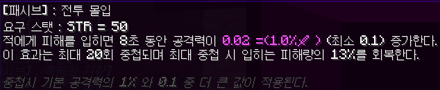
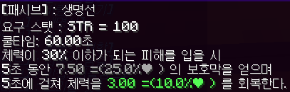
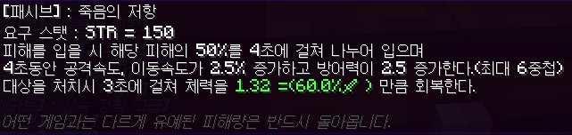
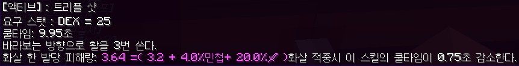
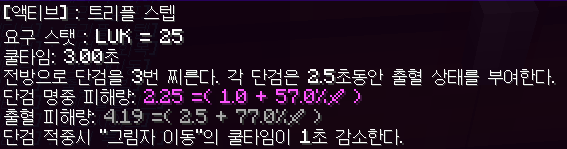
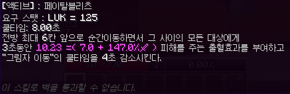

# EsperisRPGProject
## 모드 소개
본 모드는 야생을 기반으로 하는 RPG 모드입니다. 
## 호환 버전: 1.20.1 
야생과 적대적 몬스터와의 전투로 경험치를 얻어 레벨을 올려 받는 스탯 포인트(SP)를 STR, DEX, LUK, DUR 중에 원하는 스탯을 투자하여 캐릭터의 스펙을 올릴 수 있습니다. 
이 모드에서는 저레벨 구간에서 적대적 몹과의 전투를 피하는 것을 강력히 추천합니다.    

## 모드 필수 설정

/gamerule mobGriefing false (몹 폭발 블록 파괴 꺼짐)   /gamerule mobGriefing false (인벤 세이브 켜짐)

<h3> 플레이어 기본 스펙</h3>
<ul>
<li>체력: 25</li><li>공격력: 2</li><li>방어력: 20 방어력 (피해 감소 공식 : 방어력/(100+방어력) ) </li>
</ul>
  
<h2>바닐라 마크와 다른 사항들</h2>
<ul>
    <li> 스폰되는 모든 엔티티의 체력, 공격력, 이동속도가 랜덤으로 증가하고 체력에 비례하여 방어력이 증가합니다.</li>
    <li>마인크래프트 기본 방어구의 방어도 수치와 보호 관련 데미지 감소 인챈트는 적용되지 않고 캐릭터 방어력으로 인한 데미지 감소가 적용됩니다.</li>
    <li>모든 도구류의 공격력이 80% 감소하고, 활 차징 시간이 대폭 증가합니다.</li>
    <li>배고픔이 감소하지 않으며 4초마다 체력이 1 + 최대체력의 1% 만큼 회복합니다.</li>
</ul>
<h2>명령어</h2> 
<ul>
    <li>   
        <ul> 돈 관련 
            <li>/출금 수량 : 수량 만큼 돈을 출금합니다.</li>
        </ul>
    </li>
     
    <li>
        <ul>
            스킬 키 설정
            <li class="bold"> 현재키 : 현재 키 바인딩된 목록을 보여줍니다.</li>
            <li class="bold"> /키 [스킬키1~7] &nbsp; [스탯타입] &nbsp; [스킬이름]: 스킬키 1~7 에 스킬을 바인딩합니다. /키 만 입력해도 자동 완성 목록에 스킬키1~7, 스탯타입, 현재 해금된 스킬이름이 자동 완성 목록에 뜹니다.</li>
    </ul>
    </li>
     
    <li>
        <ul>
             스킬 정보 보기 
            <li class="bold"> /skill : 모든 스킬 목록을 채팅창에 띄우며 마우스를 올리면 해당 스킬의 툴팁이 보입니다. </li>   
    </ul>
    </li>
    <li>
        <ul> 
            기타 
            <li>/비틱 : 현재 오른손에 들고 있는 아이템을 채팅으로 자랑합니다. 채팅에 올라온 아이템링크에 마우스를 올려놓으면 그 아이템의 정보가 보입니다.</li>
        </ul>
    </li>
</ul>
<h2>레벨</h2>
본 모드에서 레벨은 적대적 몹 처치, 경험치 오브 획득으로 증가합니다. 
레벨이 오르면 체력 + 5, 공격력 + 0.2, 공격속도 + 1.5% 가 오르고 스탯포인트를 5개 얻습니다. 
또한 공격/피격시 레벨 차이에 비례한 추가 피해/데미지 감소가 적용됩니다.

사망시 경험치를 0~25% 잃습니다.

# Stat 정보
<h3> SP를 사용하여 스탯을 올릴 수 있으며, SP로 올린 스탯으로만 스킬을 해금할 수 있습니다.</h3>

  
<h2>스탯: STR</h2>
<h3>STR(힘) 공격과 방어의 균형이 잘 잡혀있는 밸런스형 스탯입니다. </h3>
<h4>STR 1당 체력 + 0.5 , 공격력 + 0.1 </h4>
 

 
 

https://github.com/user-attachments/assets/9d541ea9-947b-4c68-8510-7f9dfb191286

 

https://github.com/user-attachments/assets/f1b15c33-69c1-481a-8a9a-e4a9e08510fe

 

https://github.com/user-attachments/assets/df19ae4e-924f-4683-80f5-0bb05f75d7b6

 

https://github.com/user-attachments/assets/3b9194c2-42ed-42c5-8691-e9a8bcfb1917

 

https://github.com/user-attachments/assets/b1195d3d-415f-44d6-b55b-4177d9ce6cd5

 

https://github.com/user-attachments/assets/8a3a130d-04f8-4784-b431-6cf951e18851

 

https://github.com/user-attachments/assets/c1085a95-eb2a-4826-b7b0-159fd1ebcfc4

<h2>스탯: DEX</h2>
<h3>DEX(민첩) 스탯은 특수활을 사용하는 원거리 딜러 스탯으로 공격력, 공격속도, 치명타 확률이 필요한 왕귀형 스탯입니다.</h3>
DEX 1당 공격력+ 0.025, 공격속도 + 0.4%, 이동속도 + 0.015%, 크리티컬확률 + 0.008%, 회피율 소폭 상승
 
 
 

https://github.com/user-attachments/assets/84bbd2f7-f598-4a36-abc0-4fd256c2d82f

 

https://github.com/user-attachments/assets/d0e0ddf1-83b0-4550-b53f-b3c8d299d717

 

https://github.com/user-attachments/assets/a62edbaf-e534-4157-ad98-8ae061655915

 

https://github.com/user-attachments/assets/685b5f48-06a4-49ba-8751-5ca2de839db9

 

https://github.com/user-attachments/assets/680221ce-4c75-4e7d-bb3e-2323e850a36d

 

https://github.com/user-attachments/assets/b591d917-a528-4177-866b-ea7351d91e80

 

https://github.com/user-attachments/assets/10b84885-bc93-4e81-91f3-26af2ee92f4e

<h2>스탯: LUK</h2>
<h3>LUK(운) 스탯은 출혈 부여와 스킬 쿨타임 초기화 매커니즘을 이용한 폭발적 단일 피해량을 가지는 스탯입니다.</h3>
LUK 1당 공격력+ 0.025, 공격속도 + 0.0177%, 이동속도 + 0.0077%, 크리티컬확률 + 0.02%,크리티컬 데미지 + 0.1%, 회피율 상승
 
 

https://github.com/user-attachments/assets/b0b1ce14-26ef-49ba-b35d-e7160620563e

 

https://github.com/user-attachments/assets/631986aa-840d-4deb-9c42-9d5680f48e8f

 

https://github.com/user-attachments/assets/a2b8f868-cedf-4e33-b6f3-ca51c261601d

 

https://github.com/user-attachments/assets/e6c28379-d059-49b0-94cb-b45a1233038e

 

https://github.com/user-attachments/assets/4710233b-e5c4-47d9-86ed-2a8f44130627

 

https://github.com/user-attachments/assets/4a044727-25be-4618-bc8c-508e1ac28b0a

 

https://github.com/user-attachments/assets/9033a6ca-488c-41d0-9ad1-1a19b8805f1d

 

https://github.com/user-attachments/assets/afc0d003-799b-453b-9788-bb9460bef4ee

<h2>스탯: DUR</h2>
<h3>DUR(내구) 스탯은 매우 높은 내구력으로 높은 전투 지속력과 CC, 총공세를 이용한 전투 방식 변경을 가지는 탱커형 스탯입니다.</h3>
DUR 1당 체력 + 1, 방어력 + 1
 
 
 

https://github.com/user-attachments/assets/aa7353e1-9fcf-4116-808a-6d3a82259034

 

https://github.com/user-attachments/assets/02a2dd20-6272-4c28-9950-8eb62b4498ea

 

https://github.com/user-attachments/assets/e1ba3791-f028-4aad-bb43-1f6770322ba4

 

https://github.com/user-attachments/assets/e87814f7-7389-4919-8d5a-075fa941c449

 

https://github.com/user-attachments/assets/0541947b-dfdb-4645-be44-2d4ed3d8eb04

 

https://github.com/user-attachments/assets/71b0a099-b2fc-40f8-b3cb-5305be3fe374

 

https://github.com/user-attachments/assets/27612e28-da04-48b8-9ead-6358b0a4a993

