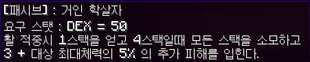
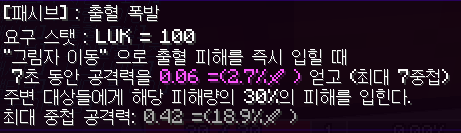
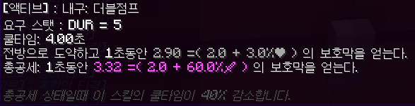
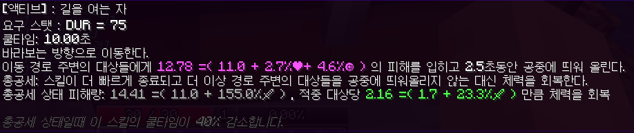
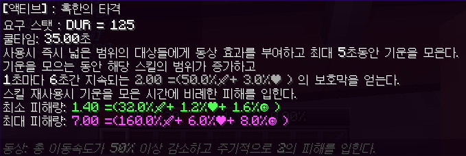

# EsperisRPGProject
## 모드 소개
본 모드는 야생을 기반으로 하는 RPG 모드입니다. 
야생과 적대적 몬스터와의 전투로 경험치를 얻어 레벨을 올려 받는 스탯 포인트(SP)를 STR, DEX, LUK, DUR 중에 원하는 스탯을 투자하여 캐릭터의 스펙을 올릴 수 있습니다.   

## 모드 필수 설정

/gamerule mobGriefing false (몹 폭발 블록 파괴 꺼짐)   /gamerule mobGriefing false (인벤 세이브 켜짐)

<h3> 플레이어 기본 스펙</h3>
<ul>
<li>체력: 25</li><li>공격력: 2</li><li>방어력: 20</li>
</ul>
  
<h2>바닐라 마크와 다른 사항들</h2>
<ul>
    <li> 스폰되는 모든 엔티티의 체력, 공격력, 이동속도가 랜덤으로 증가합니다.</li>
    <li>마인크래프트 기본 방어구의 방어도 수치와 보호 관련 데미지 감소 인챈트는 적용되지 않고 캐릭터 방어력으로 인한 데미지 감소가 적용됩니다.</li>
    <li>모든 도구류의 공격력이 80% 감소하고, 활 차징 시간이 대폭 증가합니다.</li>
    <li>배고픔이 감소하지 않으며 4초마다 체력이 1 + 1% ❤ 만큼 회복합니다.</li>
</ul>
<h2>명령어</h2> 
<ul>
    <li>   
        <ul> 돈 관련 
            <li>/출금 수량 : 수량 만큼 돈을 출금합니다.</li>
        </ul>
    </li>
     
    <li>
        <ul>
            스킬 키 설정
            <li class="bold"> 현재키 : 현재 키 바인딩된 목록을 보여줍니다.</li>
            <li class="bold"> /키 [스킬키1~7] &nbsp; [스탯타입] &nbsp; [스킬이름]: 스킬키 1~7 에 스킬을 바인딩합니다. /키 만 입력해도 자동 완성 목록에 스킬키1~7, 스탯타입, 현재 해금된 스킬이름이 자동 완성 목록에 뜹니다.</li>
    </ul>
    </li>
     
    <li>
        <ul> 
            기타 
            <li>/비틱 : 현재 오른손에 들고 있는 아이템을 채팅으로 자랑합니다. 채팅에 올라온 아이템링크에 마우스를 올려놓으면 그 아이템의 정보가 보입니다.</li>
        </ul>
    </li>
</ul>
<h2>레벨</h2>
본 모드에서 레벨은 적대적 몹 처치, 경험치 오브 획득으로 증가합니다. 
레벨이 오르면 체력 + 5, 공격력 + 0.2, 공격속도 + 1.5% 가 오르고 스탯포인트를 5개 얻습니다. 
또한 공격/피격시 레벨 차이에 비례한 추가 피해/데미지 감소가 적용됩니다.

사망시 경험치를 0~25% 잃습니다.

## Skill 정보
### 스탯: STR
STR 1당 체력 + 0.5 , 공격력 + 0.1
 

 
 
 
 
 
 
 
 

### 스탯: DEX
DEX 1당 공격력+ 0.025, 공격속도 + 0.4%, 이동속도 + 0.015%, 크리티컬확률 + 0.008%, 회피율 소폭 상승
 
 
 
 
 
 
 
 
 

### 스탯:  LUK
LUK 1당 공격력+ 0.025, 공격속도 + 0.0177%, 이동속도 + 0.0077%, 크리티컬확률 + 0.02%,크리티컬 데미지 + 0.1%, 회피율 상승
 
 
 
 
 
 
 
 
 
### 스탯:  DUR
DUR 1당 체력 + 1, 방어력 + 1
 
 
 
 
 
 
 
 
 
